# Giải Rubik 3x3 — dành cho bạn tiểu học

Làm từng bước. Xong bước nào thì đánh dấu, rồi mới sang bước sau.

**Thứ tự làm**

1. Hoa cúc trắng
2. Dấu cộng trắng ở mặt dưới
3. 4 góc trắng (xong tầng dưới)
4. Tầng giữa
5. Dấu cộng vàng
6. Tô vàng kín mặt trên
7. Xếp 4 góc (mắt kính)
8. Xếp 4 cạnh (bước cuối)

> **Luật vàng:** Từ bước 3 trở đi, luôn để **vàng ở trên**, **trắng ở dưới**. Đừng lật cả khối.

---

## Trước khi bắt đầu

### Màu đối diện

Trên Rubik chuẩn:

- Trắng đối vàng
- Đỏ đối cam
- Xanh biển đối xanh lá

Cầm khối: **vàng ở trên, trắng ở dưới**.

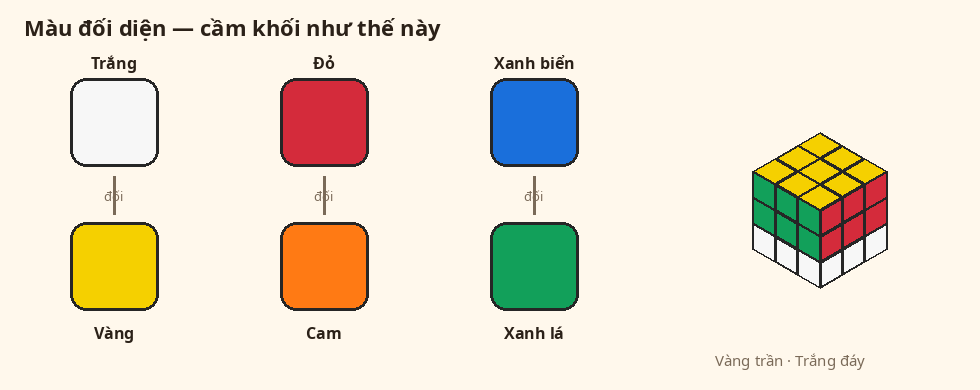

Nếu nhà bạn trắng **không** đối vàng, hãy đổi sang khối chuẩn.

### Ô giữa không bao giờ đổi chỗ

Ô giữa mỗi mặt là “nhà” của màu đó.  
Mình chỉ xếp các viên **cạnh** (2 màu) và viên **góc** (3 màu) cho khớp ô giữa.

### Cách đọc chữ xoay

Nhìn khối, vàng ở trên, mặt trước là mặt đang nhìn.

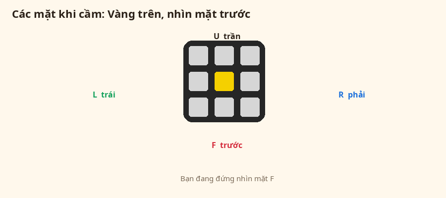

| Chữ | Nghĩa dễ nhớ |
|---|---|
| `R` | Mặt phải — xoay **lên** |
| `R'` | Mặt phải — xoay **xuống** |
| `L` | Mặt trái — xoay **xuống** |
| `L'` | Mặt trái — xoay **lên** |
| `U` | Tầng trên — đẩy **sang trái** |
| `U'` | Tầng trên — đẩy **sang phải** |
| `F` | Mặt trước — xoay thuận |
| `F'` | Mặt trước — xoay ngược |
| `B` | Mặt sau |
| `2` | Xoay **2 nấc** (nửa vòng), ví dụ `F2`, `U2` |

Dấu `'` đọc là “phẩy” = xoay ngược lại.

---

## Hai phép thuật (học thuộc)

Học 2 bộ này trước. Nhiều bước chỉ dùng chúng.

### Tay phải

`R U R' U'`

1. Tay phải xoay **lên** (`R`)
2. Đẩy tầng trên **sang trái** (`U`)
3. Tay phải xoay **xuống** (`R'`)
4. Đẩy tầng trên **sang phải** (`U'`)

### Tay trái

`L' U' L U`

1. Tay trái xoay **lên** (`L'`)
2. Đẩy tầng trên **sang phải** (`U'`)
3. Tay trái xoay **xuống** (`L`)
4. Đẩy tầng trên **sang trái** (`U`)

Luyện vài lần cho tay nhớ, rồi mới làm khối.

---

## Bước 1 — Hoa cúc trắng

**Mục tiêu:** 4 viên cạnh trắng vây quanh ô vàng.  
Ô trắng phải **ngửa lên trên**, không được nằm hông.

**Cầm:** vàng ở trên.

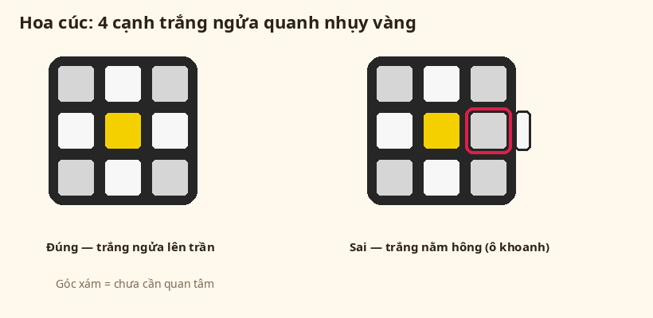

Góc (viên 3 màu) chưa cần lo.

### Thấy viên trắng ở đâu thì làm gì?

**Cánh đã đúng** (trắng đã ngửa quanh vàng)  
→ Để yên. Đừng xoay mặt sẽ đá cánh này.

**Ở mặt dưới, trắng nhìn xuống** (không thấy trắng ở hông)  
→ Xoay mặt đó **2 nấc**. Trắng sẽ lên trên.

**Ở mặt dưới, trắng nhìn ra hông**  
→ Xoay mặt hông đó **1 nấc** cho trắng ngửa lên.  
Nếu đang có cánh cúc đúng ngay chỗ đó: xoay tầng trên (`U`) đưa cánh đúng sang chỗ khác **trước**.

**Ở tầng giữa**  
Đặt viên ra **trước, bên phải**:

- Trắng nhìn về mình → xoay `R`
- Trắng nhìn sang phải → xoay `F'`

**Ở trên rồi nhưng trắng nằm hông** (bị lật)

1. Xoay tầng trên, đưa viên ra mặt trước.
2. Góc trên-phải của mặt trên phải **trống** (chưa có cánh cúc).
3. Xoay `F` rồi `R`.

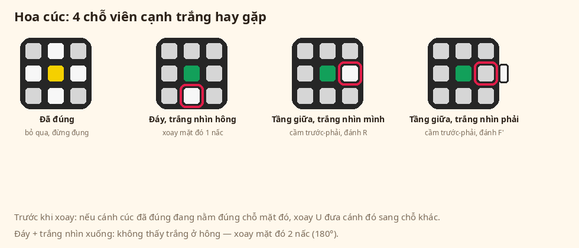

### Xong khi nào?

Nhìn mặt trên: 4 ô trắng quanh ô vàng.

---

## Bước 2 — Dấu cộng trắng ở mặt dưới

**Mục tiêu:** 4 cánh cúc lật xuống dưới, thành dấu cộng trắng.  
Màu hông của mỗi cánh phải **khớp ô giữa** cùng màu.

**Cầm:** vẫn vàng ở trên.

Làm **từng cánh một**:

1. Nhìn màu hông của một cánh cúc.
2. Xoay tầng trên đến khi màu đó **khớp ô giữa** cùng màu.
3. Xoay **đúng mặt vừa khớp** 2 nấc (nửa vòng).
   - Khớp mặt trước → `F2`
   - Khớp mặt phải → `R2`
   - Khớp mặt trái → `L2`
   - Khớp mặt sau → `B2`
4. Cánh đó xong. Làm cánh tiếp theo.  
   Cánh đã xuống rồi thì **đừng xoay mặt đó nữa**.

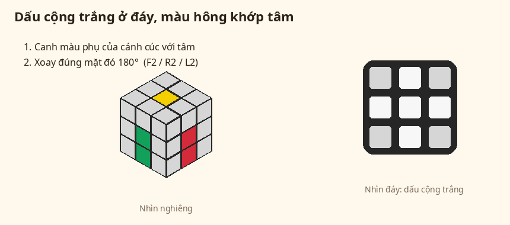

### Xong khi nào?

Lật nhìn mặt dưới: có dấu cộng trắng.  
4 mặt hông, hàng dưới cùng: màu cạnh trắng khớp ô giữa.

---

## Bước 3 — 4 góc trắng (xong tầng dưới)

**Mục tiêu:** Mặt trắng kín. Hàng dưới 4 mặt hông cũng đúng màu.

**Cầm:** trắng ở dưới, vàng ở trên. Giữ như vậy đến hết bài.

### Góc đã đúng thì bỏ qua

Trắng đã kín dưới, hai màu hông khớp ô giữa → đừng lấy lên.

### Góc đang ở tầng trên

1. Xoay tầng trên, đưa góc trắng **nằm giữa 2 ô giữa** trùng 2 màu còn lại của viên đó.
2. Đặt góc đó ra **trước, bên phải**.
3. Đánh **tay phải** (`R U R' U'`) 1 đến 5 lần, đến khi trắng chui xuống dưới.

Trắng có thể ngửa lên, nhìn về mình, hoặc nhìn sang phải.  
**Cả 3 hướng đều làm giống nhau** — cứ đánh tay phải đến khi viên chui xuống.

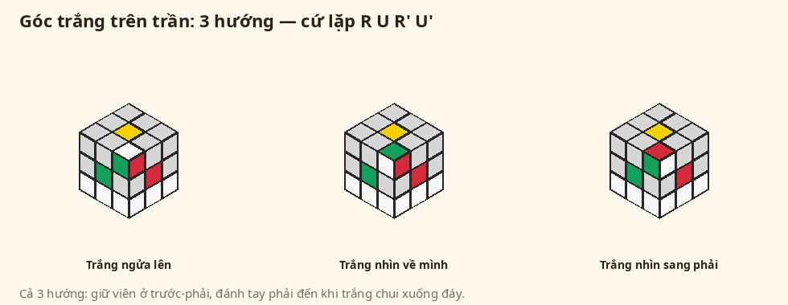

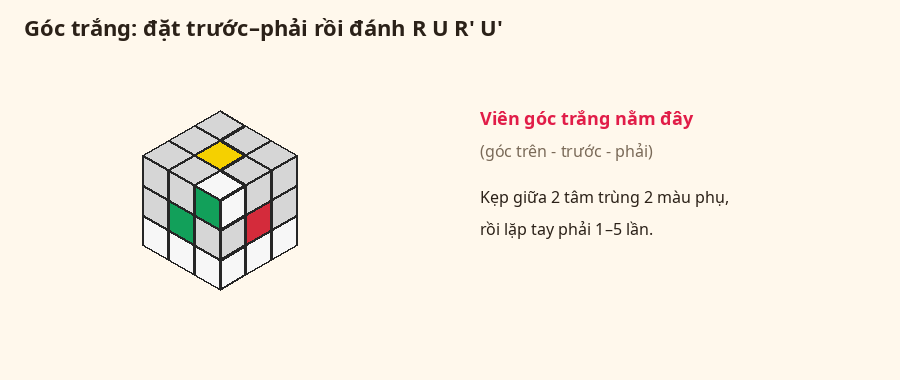

Làm lần lượt 4 góc.

### Góc trắng đang ở dưới nhưng sai

1. Xoay **cả khối** (không xoay từng tầng) để viên sai ở góc **dưới, trước, phải**.
2. Đánh tay phải **1 lần** — viên sẽ lên trên.
3. Lắp lại như góc đang ở tầng trên.

### Xong khi nào?

Mặt trắng kín.  
4 mặt hông: hàng dưới đúng màu ô giữa.

---

## Bước 4 — Tầng giữa

**Mục tiêu:** 4 viên **cạnh** ở tầng giữa đúng chỗ, đúng màu.  
(Đây là viên 2 màu nằm giữa tầng dưới và tầng trên — không phải viên góc.)

**Cạnh đã đúng** (khớp cả hai ô giữa hai bên) → bỏ qua.

---

### Tầng trên 4 cạnh đều có vàng thì sao?

Đây là chuyện **bình thường**. Có 2 khả năng. Hãy nhìn **hàng giữa** của 4 mặt hông (vòng đai tầng giữa).


**1. Tầng giữa đã đúng hết**  
Mỗi viên hàng giữa khớp màu với 2 ô giữa hai bên.  
→ **Bước 4 xong.** Sang bước 5 (dấu cộng vàng).  
Khi tầng giữa xong, 4 viên cạnh trên **phải** có vàng. Không cần tìm viên khác màu vàng nữa.

**2. Tầng giữa còn viên sai** (lệch màu, hoặc đúng chỗ nhưng bị lật)  
Các viên không-vàng đang **kẹt ở tầng giữa**, nên trên tầng trên chỉ còn cạnh vàng.  
→ Phải **đẩy viên sai lên trên**, rồi lắp lại. Làm như sau:

1. Tìm 1 khe tầng giữa **sai** (hai màu không khớp 2 ô giữa, hoặc bị lật).
2. Xoay **cả khối**, đưa khe sai ra **trước, bên phải** (khe giữa mặt trước và mặt phải).
3. Đánh **công thức sang phải** đúng 1 lần (không cần chữ T):

```
U  R  U'  R'  U'  F'  U  F
```

4. Một viên cạnh **không có vàng** sẽ xuất hiện trên tầng trên.
5. Lắp viên đó như mục “Lắp viên đang ở tầng trên” bên dưới.
6. Nếu tầng trên lại toàn vàng mà tầng giữa vẫn sai: lặp lại từ ý 1 với khe sai tiếp theo.

---

### Lắp viên đang ở tầng trên

Chỉ lấy viên cạnh **không có màu vàng**.

1. Xoay tầng trên, cho màu **trước mặt** khớp ô giữa. Nhìn sẽ thấy **chữ T**.
2. Nhìn màu trên **đỉnh đầu** viên đó:

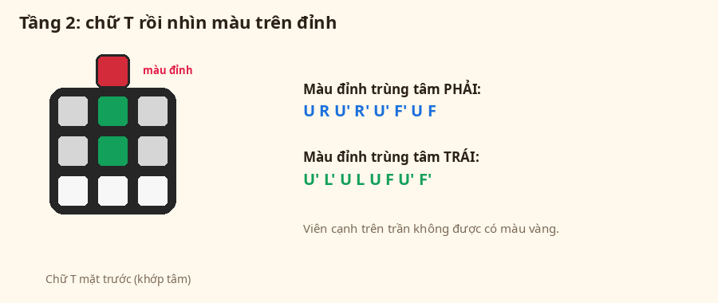

**Màu đỉnh trùng ô giữa bên phải** — đánh:

```
U  R  U'  R'  U'  F'  U  F
```

**Màu đỉnh trùng ô giữa bên trái** — đánh:

```
U'  L'  U  L  U  F  U'  F'
```

Làm đủ 4 viên. Hết viên không-vàng trên tầng trên thì quay lên mục “Tầng trên 4 cạnh đều có vàng thì sao?”.

### Xong khi nào?

Hai tầng dưới đúng hết. Chỉ còn tầng trên chưa xong.
(Lúc đó 4 cạnh tầng trên đều có vàng — đó là dấu hiệu **đúng**.)

---

## Tầng trên — làm 4 trò nhỏ

Từ đây **không lật khối**. Vàng trên, trắng dưới.

Làm lần lượt: dấu cộng vàng → tô vàng kín → mắt kính → cạnh cuối.

---

## Bước 5 — Dấu cộng vàng

**Mục tiêu:** Mặt trên có dấu cộng vàng.  
Chỉ nhìn **4 viên cạnh**. Góc (4 góc xám hay vàng) **bỏ qua**, chưa cần.

**Công thức dấu cộng** (mặt trước = mặt đang nhìn):

```
F   rồi   tay phải 1 lần   rồi   F'
```

Viết đủ chữ:

```
F  R  U  R'  U'  F'
```

### Nhìn mặt trên, thấy hình nào?

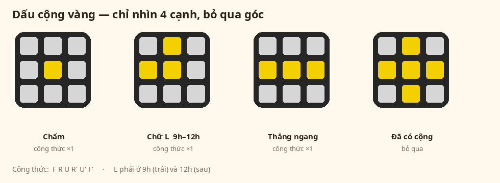

**Đã có dấu cộng**  
→ Sang bước 6. Đừng đánh nữa.

**Chấm** (chưa có cạnh vàng nào)  
→ Cầm sao cũng được. Đánh công thức **1 lần**. Sẽ ra chữ L.

**Chữ L**  
Hai cánh vàng kề nhau. Cầm sao cho:

- một cánh ở **phía sau** (trên cùng)
- một cánh ở **bên trái**

Giống chữ **L** mở lên trên và sang trái.  
→ Đánh công thức **1 lần**. Sẽ ra đường thẳng.

**Đường thẳng ngang** (nằm sang hai bên)  
→ Giữ đường thẳng nằm ngang. Đánh công thức **1 lần**. Sẽ ra dấu cộng.

**Đường thẳng dọc** (từ trên xuống dưới)

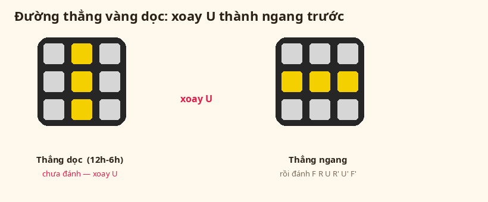

→ **Chưa đánh.** Xoay tầng trên (`U`) cho thành thẳng **ngang**, rồi mới đánh.

> Làm xong 1 lần thì **nhìn lại**. Chấm → L → ngang → cộng. Đừng đánh khi L cầm sai hoặc thẳng đang dọc.

### Xong khi nào?

Mặt trên có dấu cộng vàng (4 cạnh vàng + ô giữa vàng). Góc chưa cần kín.

---

## Bước 6 — Tô vàng kín mặt trên (công thức con cá)

**Mục tiêu:** Cả mặt trên toàn vàng (4 góc cũng vàng ngửa lên).

**Công thức con cá:**

```
R  U  R'  U  R  U2  R'
```

`U2` = tầng trên xoay **2 nấc**.

### Đếm góc vàng trên mặt trên

Chỉ đếm **4 góc**. Cạnh vàng đã có từ bước 5.

---

**Thấy 4 góc đã vàng**  
→ Sang bước 7.

---

**Thấy 1 góc vàng — hình con cá**

1. Xoay tầng trên, đưa góc vàng đó về **góc dưới, bên trái** (góc gần mình, bên trái).
2. Đánh công thức con cá **1 lần**.

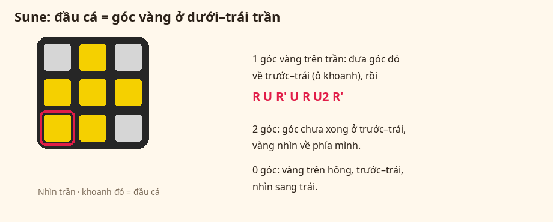

---

**Thấy 2 góc vàng**

1. Xoay tầng trên, đưa **một góc chưa vàng** về góc dưới-trái.
2. Ô vàng của góc đó phải **nhìn về phía mình** (nhìn ra mặt trước).
3. Đánh công thức con cá **1 lần**.
4. Nhìn lại. Thường sẽ ra hình con cá. Làm tiếp như trên.

---

**Thấy 0 góc vàng**

1. Xoay tầng trên, tìm một ô vàng nằm **trên hông**.
2. Đưa góc đó về dưới-trái. Ô vàng phải **nhìn sang trái**.
3. Đánh công thức con cá **1 lần**.
4. Nhìn lại, cầm lại cho đúng hình mới, rồi đánh tiếp.

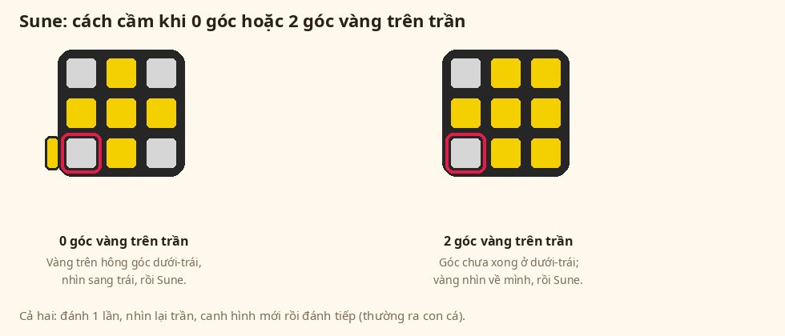

---

> **Nhớ:** Mỗi lần đánh xong, **dừng lại nhìn mặt trên**. Canh hình rồi mới đánh tiếp. Đừng đánh liên tục khi cầm sai.

### Xong khi nào?

Mặt trên kín một màu vàng.

---

## Bước 7 — Xếp 4 góc (tìm mắt kính)

**Mục tiêu:** 4 góc tầng trên đúng chỗ (màu hông khớp ô giữa).

Mặt vàng đã kín.  
Các viên **cạnh** tầng trên sẽ bị xáo — **bình thường**. Chưa cần sửa cạnh.

### Mắt kính là gì?

Nhìn **một mặt hông**, hàng trên cùng: 2 ô **góc** hai bên **cùng một màu**.

Ví dụ: Đỏ — (ô giữa khác màu) — Đỏ.

Ô giữa là **cạnh**, không phải ô giữa của cả mặt.

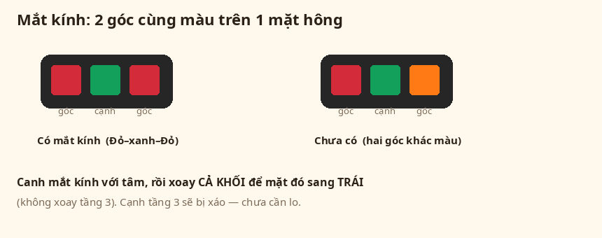

**Công thức mắt kính** — nhớ 3 khúc, đừng thuộc 1 hàng dài:

1. **Tay phải** (đã học): `R U R' U'`
2. **Nhét vào:** `R' F R2 U' R' U'`
3. **Gần tay phải, nhưng kết bằng F':** `R U R' F'`

> Khúc 3 giống tay phải (`R U R' …`) — chỉ đổi chữ cuối `U'` thành `F'`.

```
R U R' U'     R' F R2 U' R' U'     R U R' F'
```

### Thấy gì thì làm gì?

Làm **theo thứ tự**, dừng ở case đúng với khối của bạn.

---

**Case A — 4 góc đã khớp ô giữa**  
Mỗi mặt hông, 2 ô góc đúng màu ô giữa.  
→ Sang bước 8. Đừng đánh công thức.

---

**Case B — 4 mặt đều có mắt kính**

Mỗi mặt hông đều kiểu “cùng màu — khác — cùng màu”.

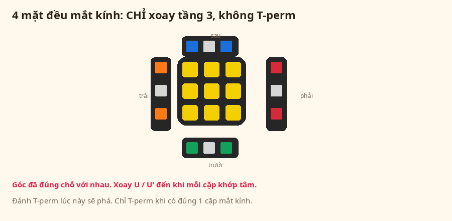

→ **Chỉ xoay tầng trên** (`U` hoặc `U'`) cho đến khi mỗi cặp khớp ô giữa.  
→ **Không đánh công thức mắt kính.** Đánh sẽ hỏng.

---

**Case C — Có đúng 1 cặp mắt kính**

1. Xoay **chỉ tầng trên**, cho 2 góc mắt kính khớp **ô giữa cùng màu**.
2. Xoay **cả khối** (không xoay tầng trên nữa) để mặt mắt kính nằm **bên tay trái**.
3. Đánh công thức mắt kính **đúng 1 lần**.

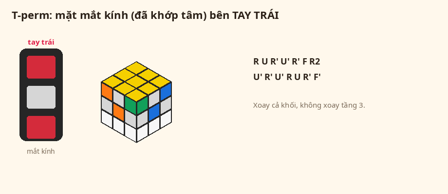

---

**Case D — Chưa có mắt kính nào**

1. Cầm mặt nào hướng về mình cũng được.
2. Đánh công thức mắt kính **1 lần**.
3. Xoay tầng trên, tìm mắt kính.
4. Làm tiếp **Case C**.

---

### Xong khi nào?

4 góc tầng trên đúng chỗ (khớp ô giữa).  
Cạnh tầng trên có thể vẫn sai — chưa sao.

---

## Bước 8 — Xếp 4 cạnh (bước cuối)

**Mục tiêu:** 4 viên cạnh tầng trên đúng chỗ. Khối xong.

Góc đã đúng. Chỉ còn xoay vòng các viên cạnh.

**Công thức cạnh cuối** — nhớ điệu 5 nhịp, không thuộc 11 chữ:

Mở đầu: `R`

Rồi làm **5 lần** (tầng trên + mặt phải), theo điệu:

**ngược — xuôi — xuôi — ngược — ngược**

| Nhịp | Tầng trên | Mặt phải |
|---|---|---|
| 1 | `U'` ngược | `R` |
| 2 | `U` xuôi | `R` |
| 3 | `U` xuôi | `R` |
| 4 | `U'` ngược | `R'` xuống |
| 5 | `U'` ngược | `R2` hai nấc |

Hai nhịp cuối đổi tay phải: xuống (`R'`), rồi hai nấc (`R2`).

```
R     U' R     U R     U R     U' R'     U' R2
```

### Thấy gì thì làm gì?

Nhìn 4 mặt hông. Tìm mặt **đầy một màu** ở hàng trên  
(2 góc + 1 cạnh giữa cùng màu, khớp ô giữa).

---

**Case A — 4 cạnh đã đúng**  
→ Xong. Đừng đánh nữa.

---

**Case B — Có 1 mặt đầy màu**

1. Xoay **cả khối**, đưa mặt đầy màu ra **phía sau** (không phải bên trái).
2. Đánh công thức cạnh cuối **1 lần**.
3. Chưa xong? Giữ mặt đúng ở **phía sau**, đánh **thêm 1 lần**.

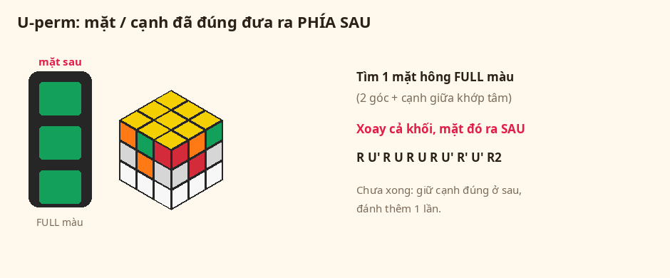

---

**Case C — Chưa có mặt nào đầy màu**

1. Cầm mặt nào cũng được.
2. Đánh công thức cạnh cuối **1 lần**.
3. Sẽ xuất hiện 1 mặt đầy màu.
4. Đưa mặt đó ra **phía sau**, làm tiếp **Case B**.

---

**Case D — Gần xong, chỉ lệch 1 nấc**

Tầng trên đúng hết với nhau, nhưng lệch so với ô giữa.

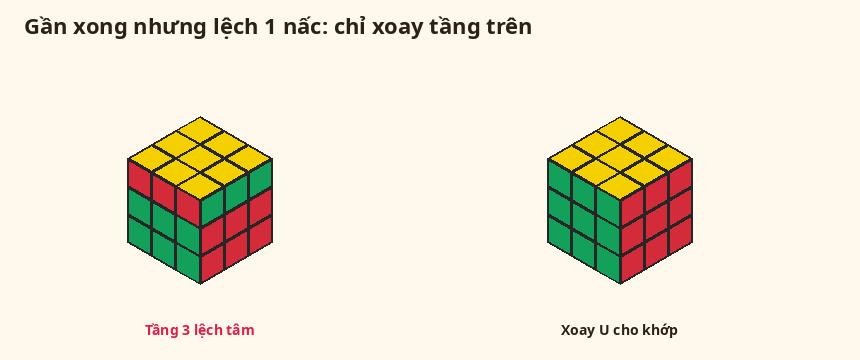

→ Chỉ xoay tầng trên (`U` / `U'` / `U2`) cho khớp.  
→ Đừng đánh công thức dài.

---

### Xong khi nào?

6 mặt, mỗi mặt một màu.

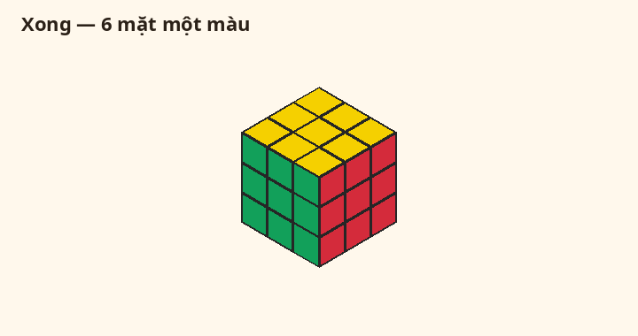

Chúc mừng bạn đã giải xong Rubik!

---

## Bị kẹt thì kiểm tra gì?

Làm từ trên xuống, dừng ở chỗ đang sai:

1. Trắng có đối vàng không?
2. Hoa cúc: 4 ô trắng **có ngửa lên** không? Cánh đúng thì đừng đụng.
3. Dấu cộng trắng: màu hông đã khớp ô giữa chưa? (Chỉ có trắng ở dưới thì chưa đủ.)
4. Góc trắng “mất”: đang cắm sai ở dưới. Lấy lên bằng tay phải 1 lần, rồi lắp lại.
5. Tầng giữa: nếu 4 cạnh trên đều vàng, nhìn hàng giữa 4 mặt hông. Đúng hết thì sang bước 5. Còn sai thì đưa khe sai ra trước-phải, đánh công thức sang phải để đẩy viên lên.
6. Dấu cộng vàng: chữ L đã cầm “sau + trái” chưa? Thẳng **dọc** thì xoay thành ngang trước.
7. Tô vàng: mỗi lần đánh xong phải **nhìn lại**, canh hình rồi mới đánh tiếp.
8. Mắt kính: **4 mặt đều mắt kính** thì chỉ xoay tầng trên. **1 cặp** thì đưa sang **tay trái** rồi đánh.
9. Bước cuối: mặt đầy màu phải ở **phía sau**.
10. Gần xong, lệch ô giữa: chỉ xoay tầng trên.

---

## Tờ nhớ công thức

| Việc đang làm | Công thức |
|---|---|
| Góc trắng / lấy góc kẹt lên | `R U R' U'` |
| Cạnh tầng giữa sang **phải** | `U R U' R' U' F' U F` |
| Cạnh tầng giữa sang **trái** | `U' L' U L U F U' F'` |
| Dấu cộng vàng | `F R U R' U' F'` |
| Tô vàng (con cá) | `R U R' U R U2 R'` |
| Mắt kính — cầm **bên trái** | 3 khúc: tay phải + `R' F R2 U' R' U'` + `R U R' F'` |
| Cạnh cuối — mặt đầy **phía sau** | `R` rồi 5 nhịp: ngược xuôi xuôi ngược ngược (`U'R UR UR U'R' U'R2`) |

### Mẹo nhớ 2 công thức dài

**Mắt kính** = tay phải + nhét F + tay phải đổi `F'`

```
R U R' U'        ← tay phải (thuộc rồi)
R' F R2 U' R' U' ← nhét vào
R U R' F'        ← giống tay phải, chữ cuối là F' không phải U'
```

**Cạnh cuối** = `R` rồi gõ điệu **ngược / xuôi xuôi / ngược ngược**

```
R   U'R   UR   UR   U'R'   U'R2
     1     2    3     4      5
```

Nhịp 4: phải **xuống**. Nhịp 5: phải **hai nấc**.

